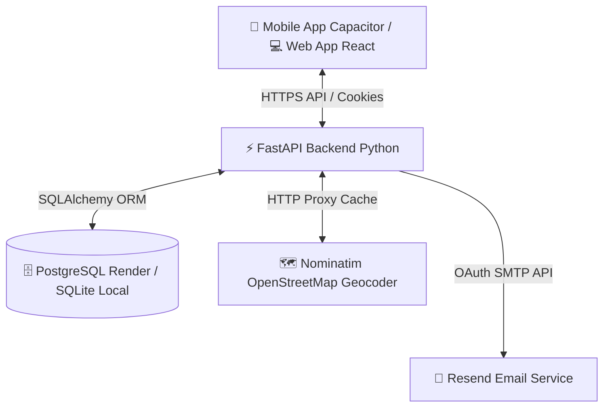

# ⚽ PitchUp - Grassroots Football & Pickup Matcher

PitchUp is a premium grassroots football pickup game matcher built as a web platform and native mobile application. It allows players to find local pickup games nearby on an interactive map, host games, coordinate comments, manage football clubs, and track player attendance and reliability.

---

## 🏗️ Architecture & Technology Stack



### Frontend
- **Framework:** React 19 (Vite)
- **Styling:** Vanilla CSS (curated HSL dark neon theme with glassmorphism overlays and smooth transitions)
- **Mapping:** Leaflet & React-Leaflet 5 (supports Dark Map, CartoDB Voyager Streets, and Google Satellite Hybrid tiles)
- **Native Wrapper:** Capacitor 8 (with native `@capacitor/app` deep link handler)
- **PWA Capabilities:** Standalone offline capability, service worker caching, and web app manifest metadata

### Backend
- **Framework:** FastAPI (Python 3.10+)
- **Database:** PostgreSQL (production on Render) / SQLite (local development) with SQLAlchemy ORM
- **Authentication:** Passwordless JWT magic links via email and httpOnly secure cross-origin session cookies
- **Scheduler:** APScheduler (performs automatic background tasks such as marking games completed and calculating player reliability)
- **Rate Limiting:** IP-based token-bucket rate limiter for geocoding and post forms

---

## 🌟 Core Features

### 1. Interactive Map & Search
- **Multi-Layer Map Tiles:** Switch between standard dark mode, detailed street views, and high-resolution Google Satellite maps.
- **Dynamic Geolocation:** Find pickup games immediately surrounding you by tapping the **🎯 Near Me** button.
- **Proximity Search:** Auto-calculates distances in kilometers using the Haversine formula directly in the SQL database query.

### 2. Match Management
- **Listings & Filters:** Filter upcoming games by format (5-a-side, 7-a-side, 11-a-side), skill level (Casual, Intermediate, Competitive), and date.
- **Spots Tracker:** Keeps real-time tabs on spots remaining. Automatically locks joins when a game is full.
- **Attendance & Reliability:** Hosts can log player attendance once a match kicks off. Players who repeatedly skip games they joined will see their **Reliability Rating** drop (automatically calculated via APScheduler).
- **Comments & Coordination:** Active message board thread on each game details panel for coordination.

### 3. Passwordless Authentication
- **Magic Links:** Sign in securely without password fatigue. Inputting your email sends a 15-minute tokenized login link via **Resend**.
- **httpOnly Cookies:** Session tokens are stored in secure, `httpOnly`, `SameSite=None` cookies to protect against XSS attacks.

### 4. Native Deep Linking (Android App Links)
- Tapping a magic link or shared game URL (e.g., `https://pitch-up-pink.vercel.app/verify?token=...`) on a phone automatically intercepts the intent and opens the native **PitchUp** app directly instead of a web browser, instantly logging the user in.

---

## 🛠️ Local Development Setup

### Prerequisites
- Node.js (v18+)
- Python (v3.10+)
- Android Studio (for mobile compilation)

---

### Backend Setup
1. Navigate to the `backend` folder:
   ```bash
   cd backend
   ```
2. Create a virtual environment and activate it:
   ```bash
   python -m venv venv
   # On Windows:
   .\venv\Scripts\activate
   # On macOS/Linux:
   source venv/bin/activate
   ```
3. Install dependencies:
   ```bash
   pip install -r requirements.txt
   ```
4. Create a `.env` file inside `backend/` and configure your local settings:
   ```ini
   DATABASE_URL=sqlite:///./pitchup.db
   JWT_SECRET=your_super_secret_jwt_key
   JWT_ALGORITHM=HS256
   ACCESS_TOKEN_EXPIRE_MINUTES=1440
   
   # Leave blank to print magic links to your terminal console instead of sending real emails
   RESEND_API_KEY=
   
   FRONTEND_URL=http://localhost:5173
   BACKEND_URL=http://localhost:8000
   ```
5. Launch the backend:
   ```bash
   uvicorn main:app --reload --port 8000
   ```

---

### Frontend Setup
1. Navigate to the `frontend` folder:
   ```bash
   cd frontend
   ```
2. Install node dependencies:
   ```bash
   npm install
   ```
3. Run the development server:
   ```bash
   npm run dev
   ```
   Open your browser at `http://localhost:5173`.

---

## 📱 Mobile App Development (Capacitor / Android)

The React web application is wrapped as a native Android project inside `frontend/android`.

### 1. Build and Sync Assets
Whenever you modify frontend React files, you must compile them and sync them into Android Studio:
```bash
cd frontend
npm run build
npx cap sync
```

### 2. Launch Android Studio
Open the native project inside Android Studio:
```bash
npx cap open android
```
From Android Studio, click **Run (Play)** to install and test on your emulator or connected physical USB debugging phone.

### 3. Setting Up App Links (Deep Linking)
To make your magic links open directly in the app:
1. Obtain your local Android debug signing SHA-256 fingerprint:
   ```powershell
   keytool -list -v -keystore "%USERPROFILE%\.android\debug.keystore" -alias androiddebugkey -storepass android -keypass android
   ```
2. Open `frontend/public/.well-known/assetlinks.json` and replace the placeholder signature with your fingerprint.
3. Commit and push the changes to GitHub so Vercel deploys the updated asset association file.

---

## 🚀 Production Deployment

### Backend (Render)
- Deploy your FastAPI app as a **Web Service**.
- Connect a **PostgreSQL** database service on Render.
- Add environment variables on the dashboard:
  - `DATABASE_URL`: (Internal Database URL from Render)
  - `RESEND_API_KEY`: (Your production Resend API Key)
  - `FRONTEND_URL`: `https://pitch-up-pink.vercel.app`
  - `BACKEND_URL`: `https://pitchup-yc95.onrender.com`

### Frontend (Vercel)
- Deploy the `frontend/` subdirectory on Vercel.
- Configure rewrites in `vercel.json` to support SPA routing (points all paths to `index.html`).
- Set the environment variable:
  - `VITE_API_URL`: `https://pitchup-yc95.onrender.com/api` (points client requests to the Render API).
